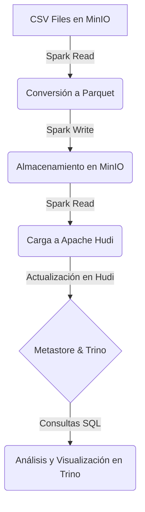

# Hudi-Spark-Airflow: Procesamiento de Datos con Apache Hudi

## 📌 Objetivo
Este proyecto implementa un flujo de procesamiento de datos utilizando **Apache Hudi, Spark y Airflow** para la ingestión, transformación y almacenamiento de datos en **MinIO** (S3-compatible). Se exploran funcionalidades clave como **Upserts, Deletes, Time Travel y consultas incrementales en Hudi**.

---

## 📂 Estructura del Proyecto

```
📦 hudi-spark-airflow
├── 📂 dags                   # DAGs de Airflow para orquestar el pipeline
│   ├── hudi_pipeline.py      # DAG principal de ingestión a Hudi
│   ├── hudi_tests_pipeline.py # DAG de pruebas (upsert, delete, time travel, incremental)
│
├── 📂 scripts                # Scripts PySpark para procesamiento de datos
│   ├── convert_csv_to_parquet.py  # Conversión de CSV a Parquet
│   ├── load_parquet_to_hudi.py    # Carga de datos en Apache Hudi
│   ├── upsert_hudi.py        # Prueba de UPSERT en Hudi
│   ├── delete_sales_hudi.py  # Prueba de DELETE en Hudi
│
├── 📂 config                 # Configuraciones adicionales
│   ├── hive-site.xml         # Configuración de Hive Metastore
│
├── 📂 trino                  # Configuración de Trino para consultas sobre Hudi
│
├── Dockerfile-airflow        # Imagen personalizada para Airflow
├── Dockerfile-spark          # Imagen personalizada para Spark
├── docker-compose.yml        # Definición de los servicios Docker
├── README.md                 # Documentación del proyecto
```

---

## 🚀 Tecnologías Utilizadas
- **Apache Hudi**: Framework para gestión de datos incrementales en lakes
- **Apache Spark**: Motor de procesamiento distribuido
- **Apache Airflow**: Orquestador de flujos de datos
- **MinIO**: Almacenamiento de objetos S3-compatible
- **Trino**: Motor de consultas SQL distribuido
- **Hive Metastore**: Catálogo de metadatos para tablas Hudi
- **PostgreSQL**: Base de datos para Airflow y Hive Metastore
- **Docker y Docker Compose**: Contenedores para la infraestructura

---

## 🔧 Configuración y Ejecución

### 1️⃣ Clonar el repositorio
```sh
git clone https://github.com/carlosaquinoperez/hudi-spark-airflow.git
cd hudi-spark-airflow
```

### 2️⃣ Iniciar la infraestructura con Docker Compose
```sh
docker-compose up -d --build
```

### 3️⃣ Acceder a los servicios
- **Airflow UI**: [http://localhost:8082](http://localhost:8082)
- **MinIO Console**: [http://localhost:9001](http://localhost:9001)
- **Trino UI**: [http://localhost:8083](http://localhost:8083)

### 4️⃣ Cargar los DAGs en Airflow
```sh
docker exec -it airflow-webserver airflow dags list
```

### 5️⃣ Ejecutar el pipeline en Airflow
Desde la UI de Airflow, habilitar y ejecutar los DAGs **hudi_pipeline** y **hudi_tests_pipeline**.

---

## 📊 Flujo de Datos y Arquitectura



---

## 🧪 Pruebas Realizadas

### ✅ 1. UPSERT en Apache Hudi
**Objetivo**: Insertar nuevos registros y actualizar existentes.
```sh
docker exec -it spark-master spark-submit /opt/airflow/scripts/upsert_hudi.py
```

### ✅ 2. DELETE en Apache Hudi
**Objetivo**: Eliminar registros específicos en la tabla Hudi.
```sh
docker exec -it spark-master spark-submit /opt/airflow/scripts/delete_sales_hudi.py
```

### ✅ 3. Time Travel en Apache Hudi
**Objetivo**: Consultar versiones anteriores de los datos.
```sql
SELECT * FROM hudi.default.walmart_sales_hudi FOR SYSTEM_TIME AS OF '20250304104111539';
```

### ✅ 4. Consultas Incrementales
**Objetivo**: Obtener solo los registros modificados en el último commit.
```sql
SELECT * FROM hudi.default.walmart_sales_hudi WHERE _hoodie_commit_time > '20250304104111539';
```

---

## 📌 Conclusiones
Este proyecto demuestra cómo implementar un pipeline de datos eficiente utilizando Apache Hudi para gestión de datos incrementales, Spark para el procesamiento distribuido y Airflow para la orquestación. Además, se exploraron funcionalidades avanzadas como **Time Travel y consultas incrementales**.

### 🚀 Próximos Pasos
- Implementar **clustering** y **compaction** en Hudi
- Optimizar el rendimiento con **Bloom Filters** y **Indexing**
- Integrar con **Apache Kafka** para streaming en tiempo real

